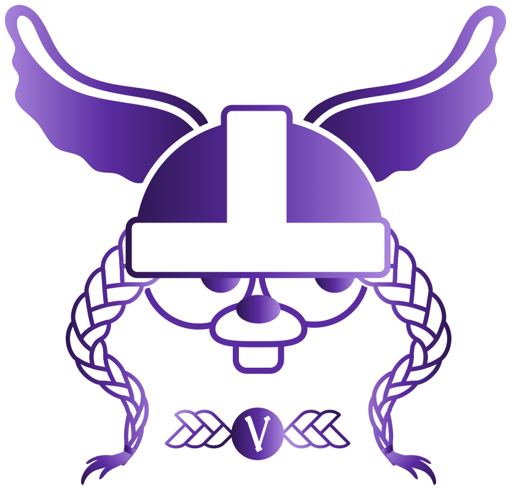

<p align="center">
  
  <h3 align="center">Valkeyrie</h3>
  <p align="center">Distributed Key/Value Store Abstraction Library</p>
</p>

# Valkeyrie

[](https://pkg.go.dev/github.com/kvtools/valkeyrie)
[](https://github.com/kvtools/valkeyrie/actions/workflows/build.yml)

`valkeyrie` provides a Go native library to store metadata using Distributed Key/Value stores (or common databases).

Its goal is to abstract common store operations (`Get`, `Put`, `List`, etc.) for multiple Key/Value store backends.

For example, you can easily implement a generic *Leader Election* algorithm on top of it (see the [docker/leadership](https://github.com/docker/leadership) repository).

The benefit of `valkeyrie` is not to duplicate the code for programs that should support multiple distributed Key/Value stores such as `Consul`/`etcd`/`zookeeper`, etc.

## Examples of Usage

You can refer to [Examples](https://github.com/kvtools/valkeyrie/blob/main/docs/examples.md) for a basic overview of the library.

```go
package main

import (
	"context"
	"log"
	"time"

	"github.com/kvtools/consul"
	"github.com/kvtools/valkeyrie"
)

func main() {
	ctx := context.Background()
	
	config := &consul.Config{
		ConnectionTimeout: 10 * time.Second,
	}

	kv, err := valkeyrie.NewStore(ctx, consul.StoreName, []string{"localhost:8500"}, config)
	if err != nil {
		log.Fatal("Cannot create store consul")
	}

	key := "foo"
	

	err = kv.Put(ctx, key, []byte("bar"), nil)
	if err != nil {
		log.Fatalf("Error trying to put value at key: %v", key)
	}

	pair, err := kv.Get(ctx, key, nil)
	if err != nil {
		log.Fatalf("Error trying accessing value at key: %v", key)
	}

	log.Printf("value: %s", string(pair.Value))

	err = kv.Delete(ctx, key)
	if err != nil {
		log.Fatalf("Error trying to delete key %v", key)
	}
}
```

## Compatibility

A **storage backend** in `valkeyrie` implements (fully or partially) the [Store](https://github.com/kvtools/valkeyrie/blob/main/store/store.go#L12) interface.

| Calls                 | Consul | Etcd | Zookeeper | Redis | BoltDB | DynamoDB |
|-----------------------|:------:|:----:|:---------:|:-----:|:------:|:--------:|
| Put                   |  🟢️   | 🟢️  |    🟢️    |  🟢️  |  🟢️   |   🟢️    |
| Get                   |  🟢️   | 🟢️  |    🟢️    |  🟢️  |  🟢️   |   🟢️    |
| Delete                |  🟢️   | 🟢️  |    🟢️    |  🟢️  |  🟢️   |   🟢️    |
| Exists                |  🟢️   | 🟢️  |    🟢️    |  🟢️  |  🟢️   |   🟢️    |
| Watch                 |  🟢️   | 🟢️  |    🟢️    |  🟢️  |   🔴   |    🔴    |
| WatchTree             |  🟢️   | 🟢️  |    🟢️    |  🟢️  |   🔴   |    🔴    |
| NewLock (Lock/Unlock) |  🟢️   | 🟢️  |    🟢️    |  🟢️  |   🔴   |   🟢️    |
| List                  |  🟢️   | 🟢️  |    🟢️    |  🟢️  |  🟢️   |   🟢️    |
| DeleteTree            |  🟢️   | 🟢️  |    🟢️    |  🟢️  |  🟢️   |   🟢️    |
| AtomicPut             |  🟢️   | 🟢️  |    🟢️    |  🟢️  |  🟢️   |   🟢️    |
| AtomicDelete          |  🟢️   | 🟢️  |    🟢️    |  🟢️  |  🟢️   |   🟢️    |

The store implementations:

- [boltdb](https://github.com/kvtools/boltdb)
- [consul](https://github.com/kvtools/consul)
- [dynamodb](https://github.com/kvtools/dynamodb)
- [etcdv2](https://github.com/kvtools/etcdv2)
- [etcdv3](https://github.com/kvtools/etcdv3)
- [redis](https://github.com/kvtools/redis)
- [zookeeper](https://github.com/kvtools/zookeeper)

The store template:

- [template](https://github.com/kvtools/template)

## Limitations

Distributed Key/Value stores often have different concepts for managing and formatting keys and their associated values.
Even though `valkeyrie` tries to abstract those stores aiming for some consistency, in some cases it can't be applied easily.

Calls like `WatchTree` may return different events (or number of events) depending on the backend
(for now, `Etcd` and `Consul` will likely return more events than `Zookeeper` that you should triage properly).

## Contributing

Want to contribute to `valkeyrie`?
Take a look at the [Contribution Guidelines](https://github.com/kvtools/valkeyrie/blob/main/CONTRIBUTING.md).

The [Maintainers](https://github.com/kvtools/valkeyrie/blob/main/maintainers.md).

## Copyright and License

Apache License Version 2.0

Valkeyrie started as a hard fork of the unmaintained [libkv](https://github.com/docker/libkv).
